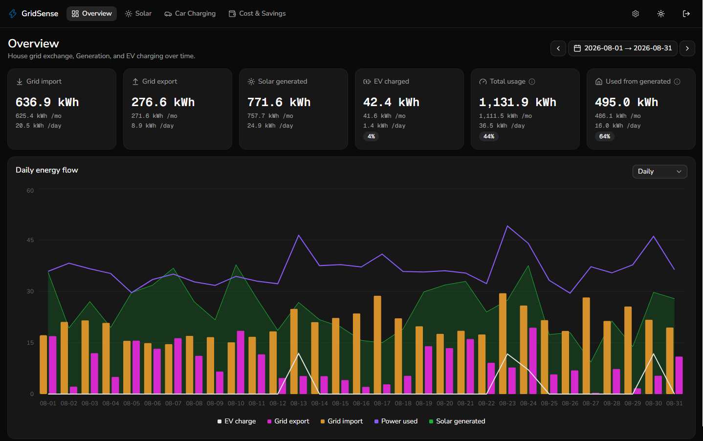
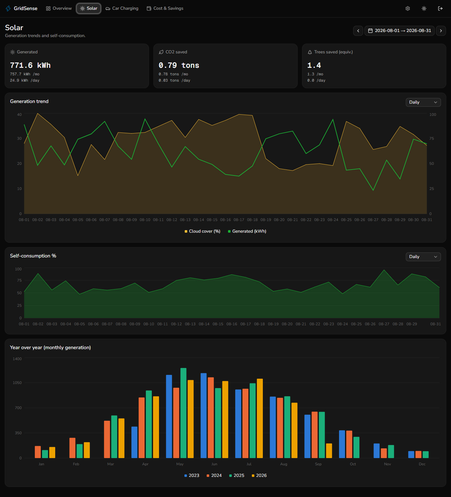
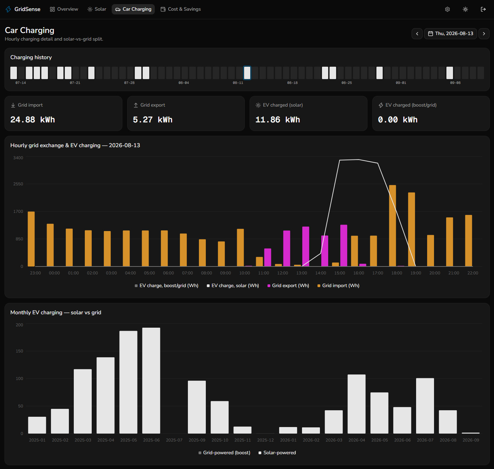
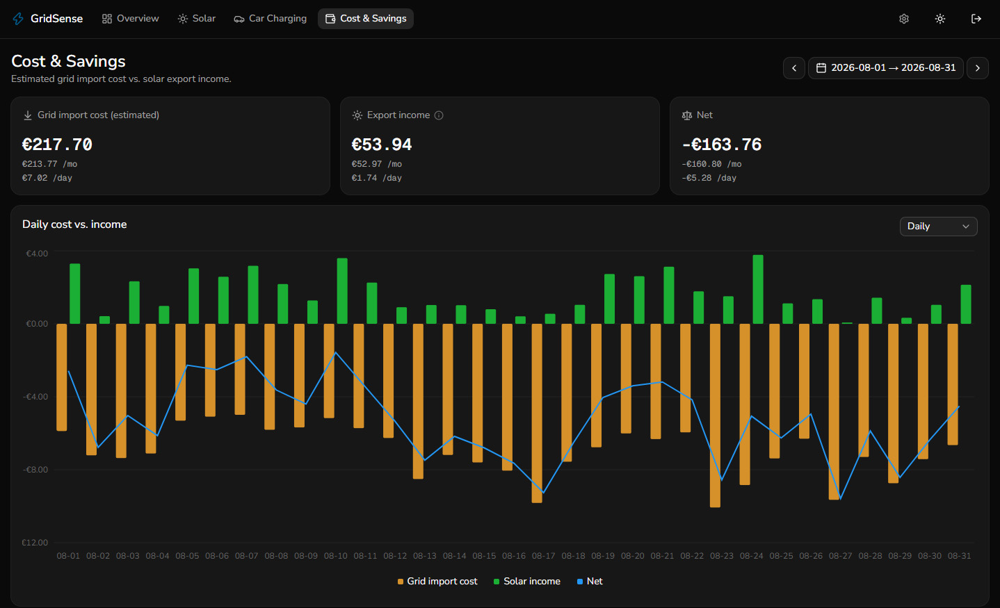

# GridSense

GridSense is a self-hosted dashboard that pulls your household energy data into one place: solar generation, EV charging, and what you import from and export to the grid. Upload the exports you already get from your inverter portal, your myenergi charger, and your electricity network, and GridSense shows how much of your solar you actually use, how much of your EV charging is powered by the sun, and what it all costs.

Everything runs on your own machine. Your data lives in a single local SQLite file, and the only outside service GridSense talks to is the free [Open-Meteo](https://open-meteo.com) weather archive (optional, no API key, and only your configured coordinates are sent).

## What it does

### Overview

A whole-house picture for any date range: grid import, grid export, solar generated, EV charged, total usage, and how much of your generated solar you used directly. Two percentages tell you the story at a glance:

- **Self-consumption**: how much of the solar you generate you use yourself rather than export.
- **Self-sufficiency**: how much of your total usage was covered by your own solar rather than the grid.

A daily energy flow chart lets you switch between day, month and year views, and the choice carries across every page.



### Solar

Generation trends from your inverter, with CO2 and tree-equivalent savings. Overlay the weather (temperature, cloud cover, sunshine and rainfall) to see why a given week was good or bad, track self-consumption over time, and compare each month against previous years.



### Car charging

Built for myenergi Zappi users. Pick any day to see hourly grid exchange alongside EV charging, split into **solar** and **boost/grid** energy, with a 30-day charging history for quick navigation and monthly totals showing how much of your charging comes from the sun.



### Cost & savings

Estimates what your grid imports cost and what your exports earn, using your own tariff rates. Rates have effective-from dates, so a price change part-way through the year is priced correctly, and a chart compares daily cost against income. Import and export rates can be imported and exported as CSV, so they are easy to back up or edit in bulk.



### Weather

Set your location on a map and backfill daily weather for your data range from Open-Meteo. It feeds the solar charts and lets you separate a poor generation month from a poor weather month.

## Bringing your data in

Upload files under **Settings, Data Import**. GridSense detects the type of each file automatically:

| Source                                    | File                             | Provides                                                                           |
| ----------------------------------------- | -------------------------------- | ---------------------------------------------------------------------------------- |
| **ESB Networks** meter data               | HDF `.csv` (half-hourly, in kWh) | Metered grid import and export                                                     |
| **myenergi Zappi**                        | hourly `.csv` export             | EV charging (solar vs boost), plus a whole-house CT clamp reading of grid exchange |
| **Solarman / Deye-style inverter portal** | yearly `.xlsx` export            | Daily solar generation                                                             |

You can start with just one source. Pages fill in as data arrives and tell you what is missing.

Exports are periodic, so re-uploading is safe: rows are matched on their natural key (device and timestamp, or plant and date), overlapping data is updated in place and nothing is duplicated. An import history table shows how many rows in each upload were new and how many were updated.

## Choosing where grid figures come from

You may have two views of your grid usage: your ESB meter (accurate) and the Zappi's CT clamp (available if you skipped the ESB export, or for days it doesn't cover). Under **Settings, Options** you choose how they combine:

- **Fallback:** use ESB where available and fill gaps from the Zappi clamp, or use ESB only and leave uncovered days out.
- **Per page:** force the Car Charging and Cost & Savings pages to a single source, with no blending.

You can also set your house timezone, which anchors every "local day" calculation, and clear stored data per source from the Danger Zone tab.

## Accounts and privacy

GridSense requires a sign-in. Sign-up is off by default, so a public deployment can't be used by strangers: enable it briefly to create your account, then turn it off again. Nothing is sent to third parties apart from the optional weather lookup.

## Running it

Images are published to GHCR on every push to `main` (`latest`) and on `v*` tags. Migrations run automatically on container start.

```bash
docker run -d -p 3000:3000 -v gridsense-data:/app/data \
  -e BETTER_AUTH_SECRET="$(openssl rand -base64 32)" \
  -e BETTER_AUTH_URL=http://localhost:3000 \
  ghcr.io/eglavin/gridsense:latest
```

Or with Docker Compose (`docker compose up -d`, works with `podman compose` too):

```yaml
services:
  gridsense:
    image: ghcr.io/eglavin/gridsense:latest
    restart: unless-stopped
    ports:
      - "3000:3000"
    environment:
      BETTER_AUTH_SECRET: ${BETTER_AUTH_SECRET:?set a long random secret}
      BETTER_AUTH_URL: http://localhost:3000
      ENABLE_SIGN_UP: "false"
    volumes:
      - gridsense-data:/app/data

volumes:
  gridsense-data:
```

Put `BETTER_AUTH_SECRET=<output of openssl rand -base64 32>` in a `.env` file next to `compose.yaml`; Compose reads it automatically. Use a named volume for `/app/data` (the container runs as the non-root `node` user, so a bind mount must be writable by uid 1000). Set `ENABLE_SIGN_UP=true` to create the first account, then turn it off again.
